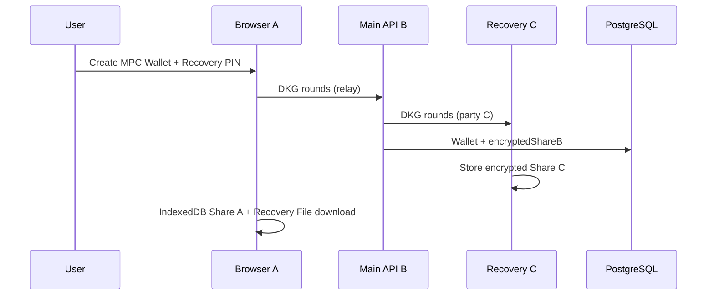
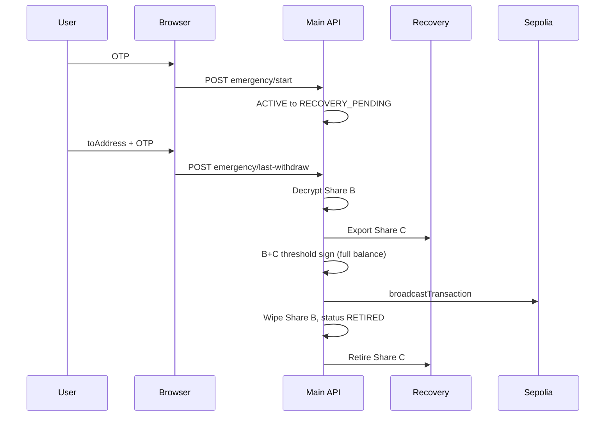

# Selfmade MPC Wallet

2-of-3 **Threshold MPC** 지갑 포트폴리오 프로젝트입니다.  
전체 개인키를 한곳에 두지 않고, Share를 브라우저 / 메인 API / Recovery Server에 분리 보관한 뒤 threshold signature로 Sepolia 거래를 서명합니다.

> Sepolia 테스트넷 · 학습/포트폴리오용입니다. 메인넷·실자산 용도가 아닙니다.

---

## 핵심 정책

| Share | 위치 | 역할 |
| --- | --- | --- |
| **A** | 고객 브라우저 (IndexedDB + 기기 AES-GCM) | 평상시 출금 참여 |
| **B** | 메인 API (`Wallet.encryptedShareB`) | 평상시·비상 출금 참여 |
| **C** | Recovery Server (별도 SQLite) | **비상 전용** — 일반 출금에 사용하지 않음 |

- **임계값:** 2-of-3 (DKLs23 / Silence Laboratories WASM)
- **일반 경로:** A + B (Share C 미사용) — UI 연결 준비됨, 서명 API는 후속 작업
- **비상 경로:** Recovery File까지 분실 시 Google OTP → B + C 전액 출금 → 지갑 `RETIRED`
- **전체 private key**를 생성·저장·재조립하지 않습니다.

---

## 모노레포 구조

```
apps/
  web/          # React + Vite (Dashboard, Recovery File, OTP UI)
  api/          # NestJS + Prisma + PostgreSQL (Share B, DKG 오케스트레이션)
  recovery/     # NestJS + SQLite (Share C 전용, 브라우저에서 직접 호출 금지)
packages/
  mpc-crypto/   # DKG / threshold sign / ETH 주소·서명 헬퍼
```

| 서비스 | 포트 | 설명 |
| --- | --- | --- |
| Web | `5173` | 프론트엔드 |
| API | `3000` | 메인 서버 |
| Recovery | `3001` | Share C / DKG party C |

---

## 구현된 기능

### 1. 인증
- 회원가입 / 로그인 (JWT httpOnly cookie)
- 계정별 Google Authenticator TOTP (`JWT_SECRET`에서 secret 파생)
- Settings에서 OTP secret / otpauth URL 확인

### 2. MPC 지갑 생성 (DKG)
- 브라우저(A) + API(B) + Recovery(C) 2-of-3 DKG
- 생성 결과:
  - Share A → IndexedDB 암호화 저장
  - Share B → API DB AES-GCM 저장
  - Share C → Recovery Server 저장
  - PIN으로 암호화된 **Recovery File** 1회 다운로드

### 3. Browser Share 복구
- Recovery File 업로드 + 6자리 PIN
- 브라우저에서만 복호화 → IndexedDB에 Share A 재저장
- Share / PIN은 서버로 전송하지 않음 (성공 시 감사 이벤트만 보고)

### 4. 비상 복구 (OTP + B+C)
1. Google OTP 인증 → `RECOVERY_PENDING`
2. 수신 주소 + OTP 재확인 → B+C threshold 서명
3. **잔액 전액** 출금 (부분 출금 불가) 후 `RETIRED`
4. Share B 삭제, Share C retire, 이후 새 MPC 지갑 생성 가능

### 5. 지갑 수명주기

`ACTIVE` → `RECOVERY_PENDING` → `RETIRING` → `RETIRED`

- 목록/잔액 조회는 live 지갑만 (`RETIRED` 제외)
- `RETIRED` 지갑으로는 서명·비상 재시작 불가
- 출금 이력·감사 로그는 `RETIRED`도 조회 가능

### 6. Audit
주요 이벤트: `MPC_WALLET_CREATED`, `RECOVERY_FILE_CREATED`, `BROWSER_SHARE_RECOVERED`,  
`EMERGENCY_*`, `WALLET_RETIRED` 등  
(민감 키워드 `share` / `pin` / `otp` 등은 audit `data`에서 제거)

---

## 아키텍처 흐름

### 지갑 생성 (DKG)



### 비상 전액 출금 (B+C)



---

## 로컬 실행

### 사전 요구
- Node.js 22+
- PostgreSQL (메인 API)
- Recovery는 SQLite 파일 사용

### 1. 의존성

```bash
npm install
cd apps/api && npx prisma migrate deploy && npx prisma generate
cd ../recovery && npx prisma db push && npx prisma generate
```

### 2. 환경 변수

**`apps/api/.env`** (핵심)

| 변수 | 설명 |
| --- | --- |
| `DATABASE_URL` | PostgreSQL |
| `JWT_SECRET` | JWT + 계정별 TOTP 파생 |
| `FRONTEND_URL` | CORS (예: `http://localhost:5173`) |
| `SEPOLIA_RPC_URL` | Sepolia RPC |
| `BACKEND_SIGNER_PRIVATE_KEY` | Provider/가스용 (MPC 지갑 키 아님) |
| `WALLET_ENCRYPTION_KEY` | Share B AES-256 키 (64 hex) |
| `RECOVERY_BASE_URL` | `http://localhost:3001` |
| `RECOVERY_SERVICE_TOKEN` | Recovery와 동일한 서비스 토큰 |

**`apps/recovery/.env`**

| 변수 | 설명 |
| --- | --- |
| `RECOVERY_DATABASE_URL` | `file:./recovery.db` |
| `PORT` | `3001` |
| `RECOVERY_SERVICE_TOKEN` | API와 **동일** 값 |
| `RECOVERY_ENCRYPTION_KEY` | Share C AES 키 (Share B와 **다른** 64 hex) |

**`apps/web/.env`**

| 변수 | 설명 |
| --- | --- |
| `VITE_API_URL` | `http://localhost:3000` |

키 생성 예:

```bash
node -e "console.log(require('crypto').randomBytes(32).toString('hex'))"
```

### 3. 개발 서버 (터미널 3개)

```bash
npm run dev:recovery   # :3001
npm run dev:api        # :3000
npm run dev:web        # :5173
```

브라우저에서 회원가입 → Settings에 OTP 등록 → Dashboard에서 **Create MPC Wallet**.

---

## 주요 API

인증된 요청은 JWT cookie 사용.

| Method | Path | 설명 |
| --- | --- | --- |
| `POST` | `/wallets/mpc/dkg/start` … `/complete` | DKG 라운드 |
| `POST` | `/wallets/:id/emergency/start` | OTP → `RECOVERY_PENDING` |
| `POST` | `/wallets/:id/emergency/last-withdraw` | B+C 전액 출금 → `RETIRED` |
| `GET` | `/wallets` | Live 지갑 목록 |
| `GET` | `/wallets/retired` | 폐기 지갑 메타 |
| `GET` | `/wallets/:id/balance` | 잔액 (RETIRED 거부) |
| `GET` | `/wallets/:id/withdraws` | 출금 이력 |
| `GET` | `/wallets/:id/audits` | 감사 로그 |
| `POST` | `/wallets/:id/audit-events` | 브라우저 비민감 이벤트 보고 |
| `GET` | `/auth/totp-setup` | OTP secret / otpauth URL |

Recovery (`:3001`, service token only):

| Method | Path | 설명 |
| --- | --- | --- |
| `PUT` | `/shares` | Share C 저장 |
| `POST` | `/shares/:walletId/export` | 비상 서명용 Share C export |
| `POST` | `/shares/:walletId/retire` | Share C 폐기 |
| `POST` | `/dkg/sessions/*` | DKG party C |

---

## 테스트

```bash
# 단위 테스트
npm run test:api
npm run test:web

# 통합 테스트 (Recovery 서버 실행 필요)
npm run dev:recovery
npm run test:integration
```

통합 시나리오 (`mpc-lifecycle.integration.spec.ts`):

1. DKG로 ACTIVE 지갑 생성  
2. OTP로 `RECOVERY_PENDING`  
3. B+C 전액 출금(잔액 0이면 브로드캐스트 없이 RETIRED)  
4. Share wipe / Audit 검증  
5. RETIRED 후 새 지갑 생성  

---

## 보안 메모 (데모 기준)

- Share / PIN / OTP 값은 로그·API 응답에 넣지 않음
- Recovery는 브라우저에서 호출하지 않음 (API ↔ Recovery만)
- Share B / Share C 암호화 키 분리
- `RETIRED` 이후 해당 지갑 재서명 불가
- OTP 연속 실패 시 짧은 잠금 (인메모리)

---

## 아직 / 후속

| 항목 | 상태 |
| --- | --- |
| A+B 일반 출금 (부분 금액) | 크립토·UI 골격만 — 서명·broadcast 플로우 후속 |
| Queue/Worker 비동기 출금 | 현재 비상 출금은 동기 처리 |
| 레거시 DFNS / 6종 지갑 / KMS 데모 | 제거됨 (이 저장소는 Selfmade MPC 중심) |

---

## 스택

- **Web:** React 19, Vite, ethers v6  
- **API:** NestJS 11, Prisma 6, PostgreSQL, speakeasy  
- **Recovery:** NestJS, SQLite  
- **MPC:** `@silencelaboratories/dkls-wasm-ll-*`, `packages/mpc-crypto`
