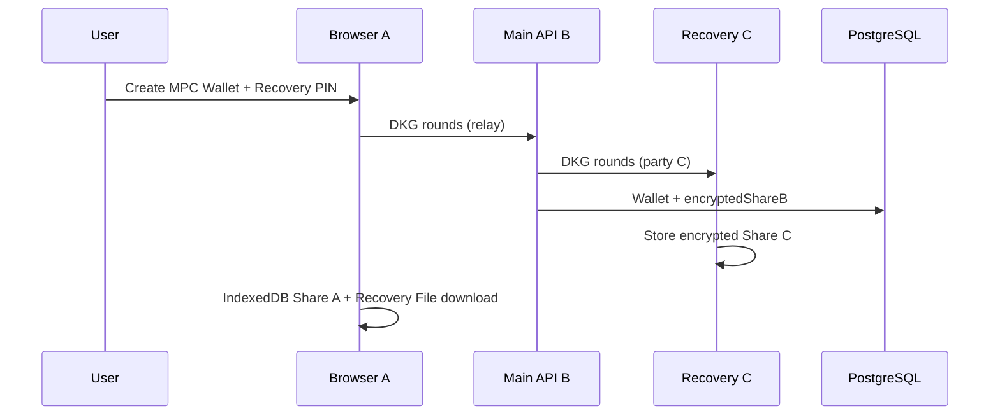
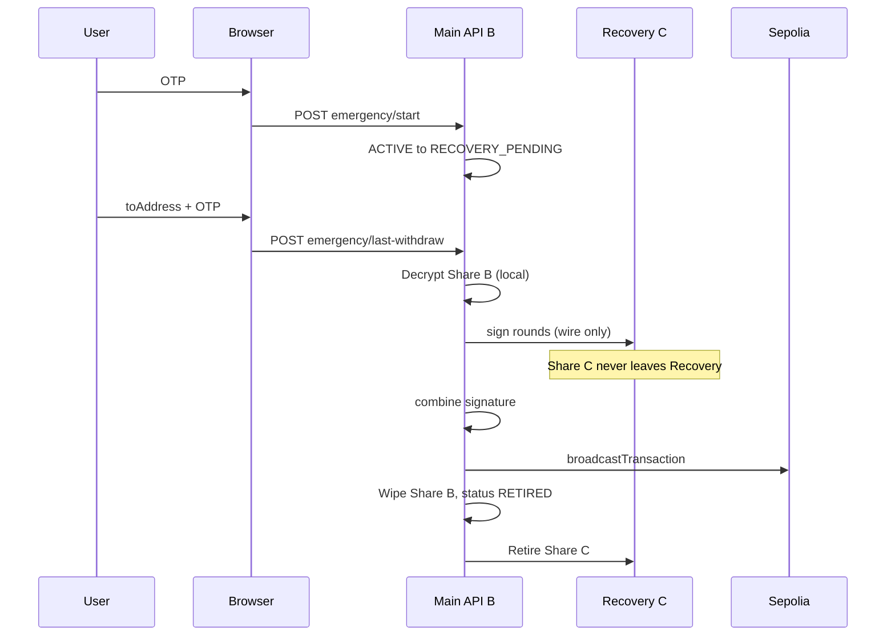
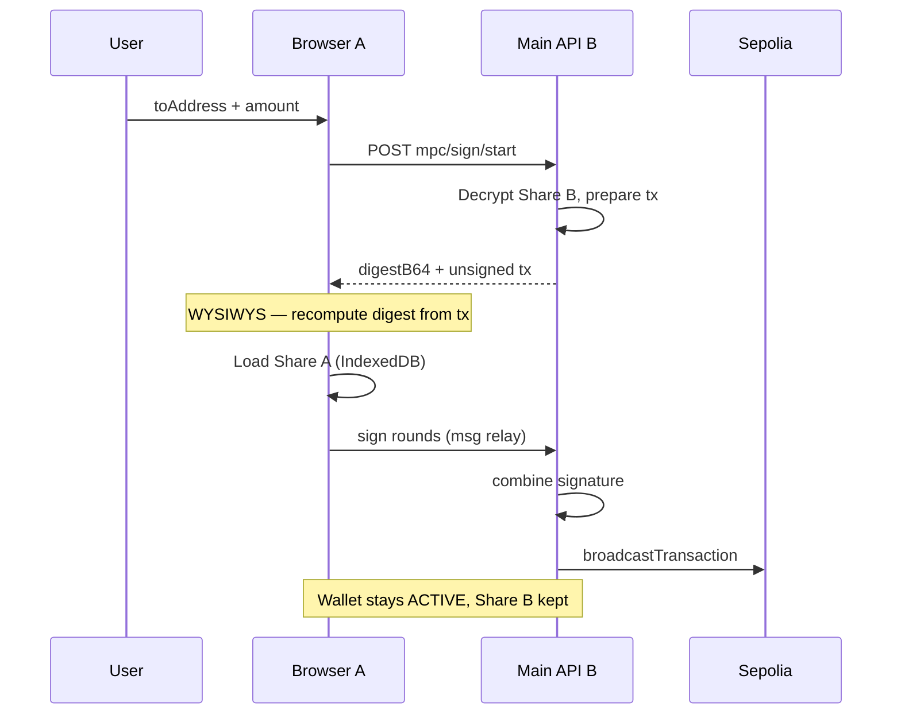

# Selfmade MPC Wallet

2-of-3 **Threshold MPC** 지갑 포트폴리오 프로젝트입니다.  
전체 개인키를 한곳에 두지 않고, Share를 브라우저 / 메인 API / Recovery Server에 분리 보관한 뒤 threshold signature로 Sepolia 거래를 서명합니다.

> Sepolia 테스트넷 · 학습/포트폴리오용입니다. 메인넷·실자산 용도가 아닙니다.

---

## 핵심 정책

| Share | 위치 | 역할 |
| --- | --- | --- |
| **A** | 고객 브라우저 (IndexedDB + 기기 AES-GCM) | 평상시 출금 참여 |
| **B** | 메인 API (`Wallet.encryptedShareB`) | 평상시·비상 출금 참여 |
| **C** | Recovery Server (별도 SQLite) | 초기 DKG + 비상 서명 전용 — 일반 출금에는 참여하지 않음 |

- **임계값:** 2-of-3 (DKLs23 / Silence Laboratories WASM)
- **일반 경로:** A + B Threshold Signing → 부분 금액 ETH 출금 (Share C 미사용, 지갑 ACTIVE 유지)
- **비상 경로:** Google OTP → B + C wire-relay 전액 출금 → `RETIRED` (Share C는 Recovery 상주)
- **전체 private key**를 생성·저장·재조립하지 않습니다.
- Share는 각 보관 위치를 떠나지 않고, **MPC wire message만** 교환합니다.
- API는 **백엔드 EOA/서명 private key를 두지 않습니다** (`RpcProviderService` = Sepolia `JsonRpcProvider`만). 가스는 MPC 지갑이 지불하고, broadcast는 이미 threshold-signed된 raw tx입니다.

---

## 모노레포 구조

```
apps/
  web/          # React + Vite (Dashboard, Recovery File, OTP UI)
  api/          # NestJS + Prisma + PostgreSQL (Share B, DKG 오케스트레이션)
  recovery/     # NestJS + SQLite (Share C 전용, 브라우저에서 직접 호출 금지)
packages/
  mpc-crypto/   # DKG / threshold sign / ETH 주소·서명 헬퍼
test-token/     # Sepolia TestToken(TTK) Hardhat 배포·민팅 (지갑 런타임과 분리)
```

| 서비스 | 포트 | 설명 |
| --- | --- | --- |
| Web | `5173` | 프론트엔드 |
| API | `3000` | 메인 서버 |
| Recovery | `3001` | Share C / DKG party C |

---

## 구현된 기능

### 1. 인증
- 회원가입 / 로그인 (JWT httpOnly cookie)
- 계정별 Google Authenticator TOTP (사용자별 random secret, `TOTP_ENCRYPTION_KEY`로 암호화 저장)
- Settings에서 OTP secret / otpauth URL은 **서버 1회만 조회** 가능 · UI는 최대 10분 표시 후 숨김 (재조회 불가)

### 2. MPC 지갑 생성 (DKG)
- 브라우저(A) + API(B) + Recovery(C) 2-of-3 DKG
- 생성 결과:
  - Share A → IndexedDB 암호화 저장
  - Share B → API DB AES-GCM 저장
  - Share C → Recovery Server 저장
  - PIN으로 암호화된 **Recovery File** 1회 다운로드 (PIN → **PBKDF2-SHA256, 210k iterations** → AES-GCM)
- **Recovery File은 브라우저에서 생성되며 API/Recovery Server에 저장되거나 전송되지 않는다.** (성공 시 감사 이벤트만)

### 3. Browser Share 복구
- Recovery File 업로드 + 6자리 PIN (복호화도 **동일 PBKDF2 → AES-GCM**)
- 브라우저에서만 복호화 → IndexedDB에 Share A 재저장
- Share / PIN / Recovery File 본문은 서버로 전송하지 않음 (성공 시 감사 이벤트만 보고)

### 4. 일반 출금 (A+B)
- ACTIVE 지갑 + Browser Share A 필요
- 브라우저(A) ↔ API(B) 서명 라운드 후 Sepolia에 **signed raw** broadcast
- `Idempotency-Key` 필수 · 지갑당 진행 중 서명 세션 1개 · `BROADCASTED`/`EXECUTED` 재요청 시 기존 txHash 반환 (재서명·재broadcast 없음)
- 진행 중 A+B(`PROCESSING`/`BROADCASTED`)와 비상 B+C·새 일반 출금은 동시에 진행하지 않음. `BROADCASTED`는 다음 요청 시 receipt를 한 번 확인(성공=`EXECUTED`, 실패=`FAILED`, 미확정=`409 TRANSACTION_PENDING`)
- 부분 금액 출금, Share B 유지, 지갑 상태 ACTIVE 유지 (TTK는 아래 TestToken)
- **WYSIWYS:** `sign/start`의 unsigned `tx`로 브라우저가 digest를 재계산·대조한 뒤 서명 (불일치 시 abort)
- Share A 없음 / 잔액 초과 시 UI 경고

### 5. 비상 복구 (OTP + B+C)
1. Google OTP 인증 → `RECOVERY_PENDING`
2. 수신 주소 + OTP 재확인 → B+C threshold 서명 (**Share C는 Recovery 밖으로 나오지 않음**, wire message만 교환)
3. **잔액 전액** 출금 (부분 출금 불가) 후 `RETIRED` — broadcast도 signed raw만 사용. (TTK가 있으면 토큰을 먼저 보낸 뒤 ETH. 세부 정책은 아래 TestToken)
4. Share B 삭제, Share C retire, 이후 새 MPC 지갑 생성 가능

### 6. 지갑 수명주기

`ACTIVE` → `RECOVERY_PENDING` → `RETIRING` → `RETIRED`

- 목록/잔액 조회는 live 지갑만 (`RETIRED` 제외)
- `RETIRED` 지갑으로는 서명·비상 재시작 불가
- 출금 이력·감사 로그는 `RETIRED`도 조회 가능

### 7. Audit / Dashboard
주요 이벤트: `MPC_WALLET_CREATED`, `RECOVERY_FILE_CREATED`, `BROWSER_SHARE_RECOVERED`,  
`WITHDRAW_*`, `EMERGENCY_*`, `WALLET_RETIRED` 등  
(민감 필드는 allow-list 키만 audit `data`에 남김)

Dashboard: 상태·잔액·Share A 유무, 출금/감사 로그(5개 단위 페이지네이션)

### 8. TestToken (TTK)

Sepolia 학습용 ERC-20 (`TTK`, 18 decimals). 배포·추가 민팅은 `test-token/` (Hardhat)에서 하며, 메인 지갑 프로세스와 분리되어 있습니다.

- API `SEPOLIA_TEST_TOKEN_ADDRESS`가 있으면 `GET /wallets/:id/balance`가 ETH와 함께 `tokens[]`를 반환하고, Dashboard·일반 출금·비상 출금에 TTK가 붙습니다. 미설정이면 ETH만 동작합니다.
- 잔액·출금 기준은 **MPC 온체인 주소**입니다. 배포 EOA로 민팅된 TTK는 MPC 주소로 보낸 뒤에야 지갑에 보입니다.
- **일반 출금 (A+B):** `asset=ETH|ERC20`. TTK는 `to=토큰 컨트랙트`, `value=0`, `data=transfer(수신주소,금액)`이고 가스는 ETH에서 냅니다. 금액 문자열 `"1"`은 1 TTK입니다. WYSIWYS가 이 calldata와 Sepolia `chainId`까지 재계산합니다.
- **비상 출금 (B+C):** TTK 전액 → ETH 전액 순. 단계마다 로컬 txHash·signed raw를 `BROADCASTED`로 저장한 뒤 RPC (재서명·다른 nonce 재broadcast 없음). TTK가 미확정이면 ETH로 넘어가지 않습니다. TTK가 남아 있는데 가스용 ETH가 부족하면 `INSUFFICIENT_GAS`로 중단하고 **`RETIRED`하지 않습니다** — MPC 주소로 소량 Sepolia ETH를 입금한 뒤 다시 시도합니다.

---

## 아키텍처 흐름

### 지갑 생성 (DKG)



### 비상 전액 출금 (B+C)



### 일반 출금 (A+B)



---

## 로컬 실행

### 사전 요구
- Node.js 22+
- PostgreSQL (메인 API)
- Recovery는 SQLite 파일 사용

### 1. 의존성

```bash
npm install
cd apps/api && npx prisma migrate deploy && npx prisma generate
cd ../recovery && npx prisma db push && npx prisma generate
```

### 2. 환경 변수

**`apps/api/.env`** (핵심)

| 변수 | 설명 |
| --- | --- |
| `DATABASE_URL` | PostgreSQL |
| `JWT_SECRET` | JWT 서명 |
| `TOTP_ENCRYPTION_KEY` | 계정별 TOTP secret AES-256 키 (64 hex, JWT와 분리) |
| `FRONTEND_URL` | CORS (예: `http://localhost:5173`) |
| `SEPOLIA_RPC_URL` | Sepolia RPC — 잔액 조회·signed raw broadcast (`BACKEND_SIGNER_*` 불필요) |
| `SEPOLIA_TEST_TOKEN_ADDRESS` | Sepolia TestToken(TTK) 컨트랙트. 잔액 표시·A+B ERC-20 출금·비상 TTK sweep (미설정 시 ETH만) |
| `WALLET_ENCRYPTION_KEY` | Share B AES-256 키 (64 hex) |
| `RECOVERY_BASE_URL` | `http://localhost:3001` |
| `RECOVERY_SERVICE_TOKEN` | Recovery와 동일한 서비스 토큰 |

**`apps/recovery/.env`**

| 변수 | 설명 |
| --- | --- |
| `RECOVERY_DATABASE_URL` | `file:./recovery.db` |
| `PORT` | `3001` |
| `RECOVERY_SERVICE_TOKEN` | API와 **동일** 값 |
| `RECOVERY_ENCRYPTION_KEY` | Share C AES 키 (Share B와 **다른** 64 hex) |

**`apps/web/.env`**

| 변수 | 설명 |
| --- | --- |
| `VITE_API_URL` | `http://localhost:3000` |

키 생성 예:

```bash
node -e "console.log(require('crypto').randomBytes(32).toString('hex'))"
```

### 3. 개발 서버 (터미널 3개)

```bash
npm run dev:recovery   # :3001
npm run dev:api        # :3000
npm run dev:web        # :5173
```

브라우저에서 회원가입 → Settings에 OTP 등록 → Dashboard에서 **Create MPC Wallet**.  
TTK를 쓰려면 배포/민팅 후 **MPC 지갑 주소**로 토큰을 보내고, API에 `SEPOLIA_TEST_TOKEN_ADDRESS`를 넣습니다. (`test-token/README.md`)

---

## 주요 API

인증된 요청은 JWT cookie 사용.

| Method | Path | 설명 |
| --- | --- | --- |
| `POST` | `/wallets/mpc/dkg/start` … `/complete` | DKG 라운드 |
| `POST` | `/wallets/mpc/sign/start` … `/complete` | A+B 일반 출금 서명 라운드 (`Idempotency-Key` 필수, 지갑당 진행 중 세션 1개) |
| `POST` | `/wallets/:id/emergency/start` | OTP → `RECOVERY_PENDING` |
| `POST` | `/wallets/:id/emergency/cancel` | `RECOVERY_PENDING` → `ACTIVE` (실수 취소) |
| `POST` | `/wallets/:id/emergency/last-withdraw` | B+C 전액 출금 → `RETIRED` |
| `GET` | `/wallets` | Live 지갑 목록 |
| `GET` | `/wallets/retired` | 폐기 지갑 메타 |
| `GET` | `/wallets/:id/balance` | ETH + 설정된 ERC-20 잔액 (RETIRED 거부) |
| `GET` | `/wallets/:id/withdraws` | 출금 이력 |
| `GET` | `/wallets/:id/audits` | 감사 로그 |
| `POST` | `/wallets/:id/audit-events` | 브라우저 비민감 이벤트 보고 |
| `GET` | `/auth/totp-status` | OTP 설정 여부 · secret 이미 공개됐는지 (평문 없음) |
| `GET` | `/auth/totp-setup` | OTP secret / otpauth URL **1회만** (이후 410) |

Recovery (`:3001`, service token only):

| Method | Path | 설명 |
| --- | --- | --- |
| `PUT` | `/shares` | Share C 저장 |
| `POST` | `/sign/sessions` … `/last` | B+C 서명 라운드 (party C, Share C 미반출) |
| `POST` | `/shares/:walletId/retire` | Share C 폐기 |
| `POST` | `/dkg/sessions/*` | DKG party C |

---

## 테스트

```bash
# 단위 테스트
npm run test:api
npm run test:web

# 통합 테스트 (Recovery 서버 실행 필요)
npm run dev:recovery
npm run test:integration
```

통합 시나리오 (`mpc-lifecycle.integration.spec.ts`):

1. DKG로 ACTIVE 지갑 생성  
2. OTP로 `RECOVERY_PENDING`  
3. B+C 전액 출금(잔액 0이면 브로드캐스트 없이 RETIRED)  
4. Share wipe / Audit 검증  
5. RETIRED 후 새 지갑 생성  

---

## 보안 메모 (데모 기준)

- Share / PIN은 로그·일반 API 응답에 넣지 않음. OTP 평문 secret은 `/auth/totp-setup` **1회 reveal만** (이후 410)
- A+B 출금 WYSIWYS: 브라우저가 unsigned `tx`로 digest 재검증 후 서명 (ERC-20 calldata는 TestToken 절)
- Recovery는 브라우저에서 호출하지 않음 (API ↔ Recovery만)
- Recovery File PIN은 PBKDF2-SHA256(210k) → AES-GCM
- Share B / Share C 암호화 키 분리
- Share C는 Recovery 프로세스 밖으로 export하지 않음 (B+C는 wire relay)
- API에 `BACKEND_SIGNER_PRIVATE_KEY` 없음 — 체인 I/O는 `RpcProviderService`만
- `RETIRED` 이후 해당 지갑 재서명 불가
- OTP 연속 실패 시 짧은 잠금 (인메모리)
- 진행 중 A+B와 비상 B+C는 상호 배제 (지갑 row lock)

---

## 아직 / 후속

포트폴리오 핵심 흐름(DKG · A+B 일반 출금 · Recovery File 복구 · OTP+B+C 비상 전액 출금 · RETIRED)은 구현 완료입니다.

| 항목 | 상태 |
| --- | --- |
| Queue/Worker 비동기 출금 | 현재 출금은 동기 HTTP 라운드 처리 |
| 프로덕션 키 관리 / HSM | 데모용 env 키 암호화 |
| 레거시 DFNS / 6종 지갑 / KMS 데모 | 제거됨 (이 저장소는 Selfmade MPC 중심) |

---

## 스택

- **Web:** React 19, Vite, ethers v6  
- **API:** NestJS 11, Prisma 6, PostgreSQL, speakeasy  
- **Recovery:** NestJS, SQLite  
- **MPC:** `@silencelaboratories/dkls-wasm-ll-*`, `packages/mpc-crypto`
