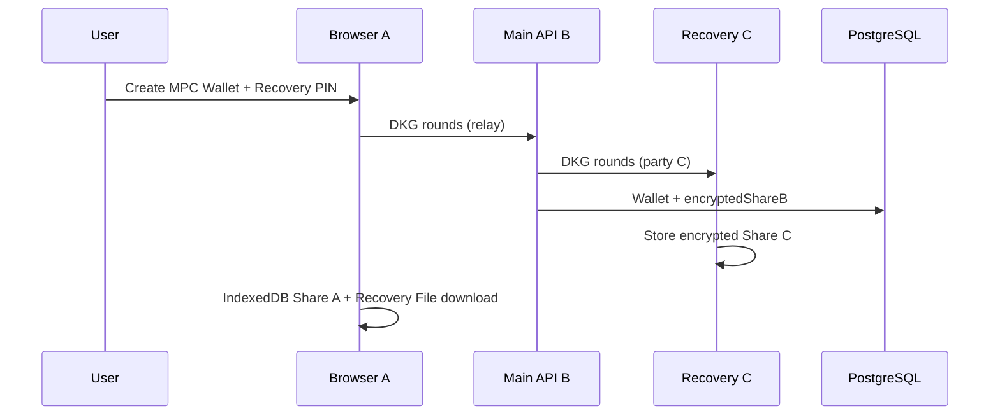
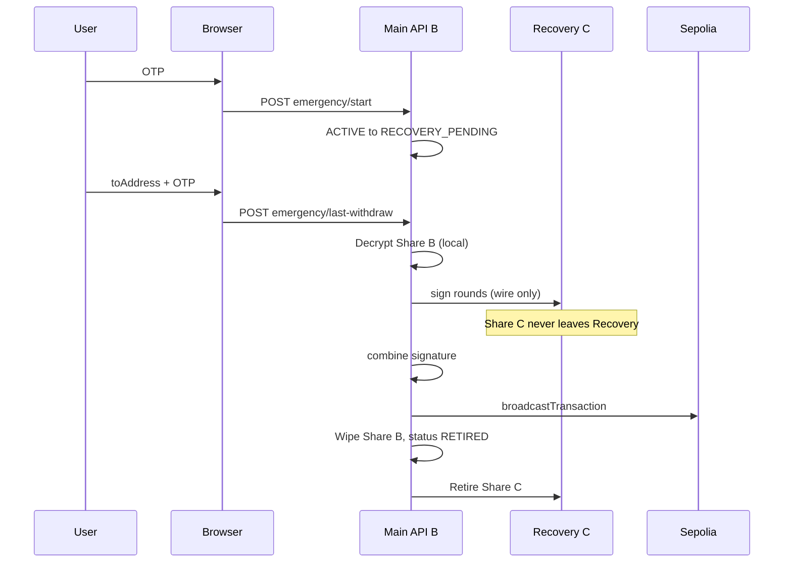
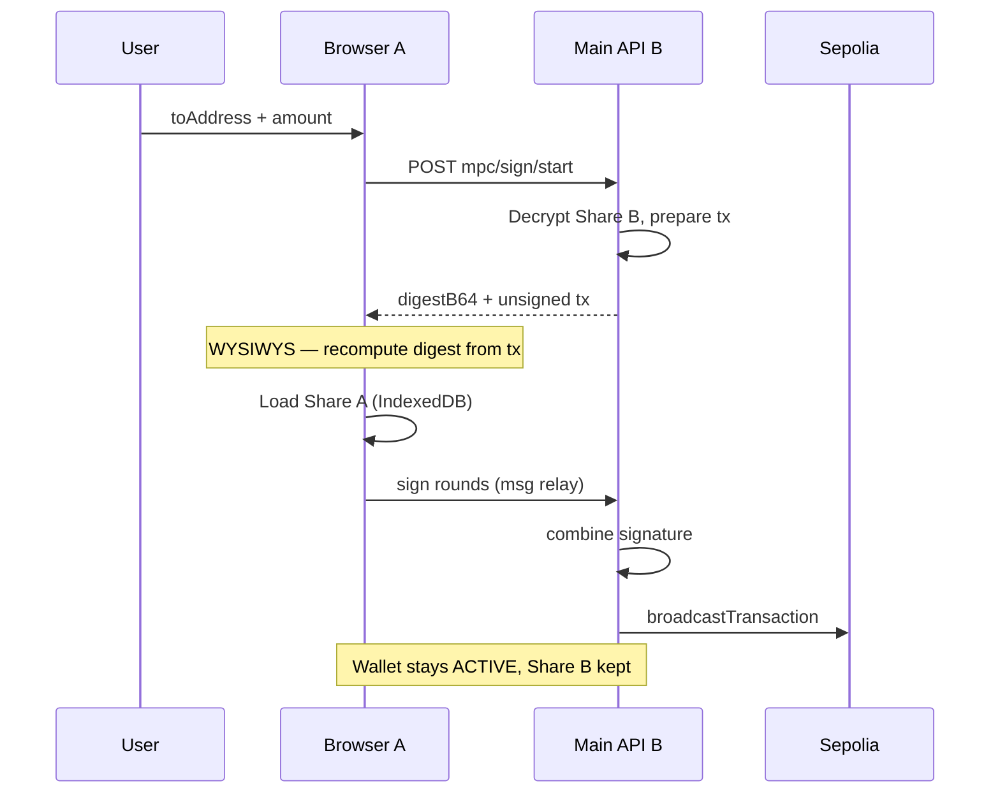

# Selfmade MPC Wallet

2-of-3 **Threshold MPC** 지갑 포트폴리오 프로젝트입니다.  
전체 개인키를 한곳에 두지 않고, Share를 브라우저 / 메인 API / Recovery Server에 분리 보관한 뒤 threshold signature로 Sepolia 거래를 서명합니다.

> Sepolia 테스트넷 · 학습/포트폴리오용입니다. 메인넷·실자산 용도가 아닙니다.

데모: [https://selfmade-mpc-wallet-web.vercel.app](https://selfmade-mpc-wallet-web.vercel.app)

---

## 핵심 정책

| Share | 위치 | 역할 |
| --- | --- | --- |
| **A** | 고객 브라우저 (IndexedDB + 기기 AES-GCM) | 평상시 출금 참여 |
| **B** | 메인 API (`Wallet.encryptedShareB`) | 평상시·비상 출금 참여 |
| **C** | Recovery Server (별도 SQLite) | 초기 DKG + 비상 서명 전용 — 일반 출금에는 참여하지 않음 |

- **임계값:** 2-of-3 (DKLs23 / Silence Laboratories WASM)
- **일반 경로:** A + B Threshold Signing → 부분 금액 ETH 출금 (Share C 미사용, 지갑 ACTIVE 유지)
- **비상 경로:** Google OTP → B + C wire-relay 전액 출금 → `RETIRED` (Share C는 Recovery 상주)
- **전체 private key**를 생성·저장·재조립하지 않습니다.
- Share는 각 보관 위치를 떠나지 않고, **MPC wire message만** 교환합니다.
- API는 **백엔드 EOA/서명 private key를 두지 않습니다** (`RpcProviderService` = Sepolia `JsonRpcProvider`만). 가스는 MPC 지갑이 지불하고, broadcast는 이미 threshold-signed된 raw tx입니다.

---

## 모노레포 구조

```
apps/
  web/          # React + Vite (Dashboard, Recovery File, OTP UI)
  api/          # NestJS + Prisma + PostgreSQL (Share B, DKG 오케스트레이션)
  recovery/     # NestJS + SQLite (Share C 전용, 브라우저에서 직접 호출 금지)
packages/
  mpc-crypto/   # DKG / threshold sign / ETH 주소·서명 헬퍼
test-token/     # Sepolia TestToken(TTK) Hardhat 배포·민팅 (지갑 런타임과 분리)
```

| 서비스 | 포트 | 설명 |
| --- | --- | --- |
| Web | `5173` | 프론트엔드 |
| API | `3000` | 메인 서버 |
| Recovery | `3001` | Share C / DKG party C |

---

## 구현된 기능

### 1. 인증
- 회원가입 / 로그인 (JWT httpOnly cookie)
- 쿠키가 붙은 `POST`/`PUT`/`PATCH`/`DELETE`는 Origin(없으면 Referer)이 `FRONTEND_URL`과 같아야 함. **`POST /auth/login`은 쿠키가 없어도** 같은 검사를 한다 (login CSRF)
- 비밀번호 변경 시 `tokenVersion` 증가 → 다른 세션의 access JWT 무효화 (현재 세션은 새 쿠키)
- 계정별 Google Authenticator TOTP (사용자별 random secret, `TOTP_ENCRYPTION_KEY`로 암호화 저장)
- Settings에서 OTP secret / otpauth URL은 **`POST /auth/totp-setup` 1회만** (상태 변경, 이후 410) · UI는 최대 10분 표시 후 숨김

### 2. MPC 지갑 생성 (DKG)
- 브라우저(A) + API(B) + Recovery(C) 2-of-3 DKG
- 생성 결과:
  - Share A → IndexedDB 암호화 저장
  - Share B → API DB AES-GCM 저장
  - Share C → Recovery Server SQLite (DKG finalize에서만 생성·암호화 저장)

  - PIN으로 암호화된 **Recovery File** 1회 다운로드 (PIN → **PBKDF2-SHA256, 210k iterations** → AES-GCM)
- **Recovery File은 브라우저에서 생성되며 API/Recovery Server에 저장되거나 전송되지 않는다.** (성공 시 감사 이벤트만)

### 3. Browser Share 복구
- Recovery File 업로드 + 6자리 PIN (복호화도 **동일 PBKDF2 → AES-GCM**)
- 브라우저에서만 복호화 → IndexedDB에 Share A 재저장
- Share / PIN / Recovery File 본문은 서버로 전송하지 않음 (성공 시 감사 이벤트만 보고)

### 4. 일반 출금 (A+B)
- ACTIVE 지갑 + Browser Share A 필요
- 브라우저(A) ↔ API(B) 서명 라운드 후 Sepolia에 **signed raw** broadcast
- `Idempotency-Key` 필수 · 지갑당 진행 중 서명 세션 1개 · `BROADCASTED`/`EXECUTED` 재요청 시 기존 txHash 반환 (재서명·재broadcast 없음)
- 진행 중 A+B(`PROCESSING`/`BROADCASTED`)와 비상 B+C·새 일반 출금은 동시에 진행하지 않음. `BROADCASTED`는 다음 요청 시 receipt를 한 번 확인(성공=`EXECUTED`, 실패=`FAILED`, 미확정=`409 TRANSACTION_PENDING`)
- 부분 금액 출금, Share B 유지, 지갑 상태 ACTIVE 유지 (TTK는 아래 TestToken)
- **WYSIWYS:** `sign/start`의 unsigned `tx`로 브라우저가 digest를 재계산·대조한 뒤 서명 (불일치 시 abort)
- Share A 없음 / 잔액 초과 시 UI 경고

### 5. 비상 복구 (OTP + B+C)
1. Google OTP 인증 → `RECOVERY_PENDING`
2. 수신 주소 + OTP 재확인 → B+C threshold 서명 (**Share C는 Recovery 밖으로 나오지 않음**, wire message만 교환)
3. 목표: 잔액 전액 출금(부분 출금 UI 없음) 후 `RETIRED`. broadcast는 signed raw만. TTK가 있으면 토큰을 먼저 보낸 뒤 ETH (세부 정책은 아래 TestToken)
4. API가 Share B를 지우고 지갑을 `RETIRED`로 바꾼 뒤 Recovery에 Share C retire를 호출한다. 이후 새 MPC 지갑 생성 가능

예외: TTK sweep 뒤 남은 ETH가 가스비보다 작으면 ETH dust를 남기고 `RETIRED`할 수 있다. Share C retire 실패는 로그만 남기고 API는 완료로 응답한다. **API `RETIRED` ≠ Recovery에서 Share C 삭제 완료.**

### 6. 지갑 수명주기

`ACTIVE` → `RECOVERY_PENDING` → `RETIRING` → `RETIRED`

- 목록/잔액 조회는 live 지갑만 (`RETIRED` 제외)
- `RETIRED` 지갑으로는 서명·비상 재시작 불가
- 출금 이력·감사 로그는 `RETIRED`도 조회 가능

### 7. Audit / Dashboard
주요 이벤트: `MPC_WALLET_CREATED`, `RECOVERY_FILE_CREATED`, `BROWSER_SHARE_RECOVERED`,  
`WITHDRAW_*`, `EMERGENCY_*`, `WALLET_RETIRED` 등  
(민감 필드는 allow-list 키만 audit `data`에 남김)

Dashboard: 상태·잔액·Share A 유무, 출금/감사 로그(5개 단위 페이지네이션)

### 8. TestToken (TTK)

Sepolia 학습용 ERC-20 (`TTK`, 18 decimals). 배포·추가 민팅은 `test-token/` (Hardhat)에서 하며, 메인 지갑 프로세스와 분리되어 있습니다.

- API `SEPOLIA_TEST_TOKEN_ADDRESS`가 있으면 `GET /wallets/:id/balance`가 ETH와 함께 `tokens[]`를 반환하고, Dashboard·일반 출금·비상 출금에 TTK가 붙습니다. 미설정이면 ETH만 동작합니다.
- 잔액·출금 기준은 **MPC 온체인 주소**입니다. 배포 EOA로 민팅된 TTK는 MPC 주소로 보낸 뒤에야 지갑에 보입니다.
- **일반 출금 (A+B):** `asset=ETH|ERC20`. TTK는 `to=토큰 컨트랙트`, `value=0`, `data=transfer(수신주소,금액)`이고 가스는 ETH에서 냅니다. 금액 문자열 `"1"`은 1 TTK입니다. WYSIWYS가 이 calldata와 Sepolia `chainId`까지 재계산합니다.
- **비상 출금 (B+C):** TTK 전액 → ETH 전액 순. 단계마다 로컬 txHash·signed raw를 `BROADCASTED`로 저장한 뒤 RPC (재서명·다른 nonce 재broadcast 없음). TTK가 미확정이면 ETH로 넘어가지 않습니다. TTK가 남아 있는데 가스용 ETH가 부족하면 `INSUFFICIENT_GAS`로 중단하고 **`RETIRED`하지 않습니다** — MPC 주소로 소량 Sepolia ETH를 입금한 뒤 다시 시도합니다. TTK 전송이 끝난 뒤 남은 ETH가 가스비보다 작으면 ETH dust를 남기고 `RETIRED`할 수 있습니다.

---

## 아키텍처 흐름

### 지갑 생성 (DKG)



### 비상 전액 출금 (B+C)



### 일반 출금 (A+B)



---

## 로컬 실행

### 사전 요구
- Node.js 22+
- PostgreSQL (메인 API)
- Recovery는 SQLite 파일 사용

순서: **의존성 설치 → `.env` 설정 → DB 초기화 → 서비스 실행**. `DATABASE_URL` / `RECOVERY_DATABASE_URL`이 없으면 migration이 실패합니다.

### 1. 의존성

```bash
npm install
```

### 2. 환경 변수

```bash
cp apps/api/.env.example apps/api/.env
cp apps/recovery/.env.example apps/recovery/.env
cp apps/web/.env.example apps/web/.env
```

예시를 복사한 뒤 시크릿(64 hex 키, 32바이트 이상 토큰)을 채웁니다. 키 생성 예는 표 아래에 있습니다.

**`apps/api/.env`** (핵심)

| 변수 | 설명 |
| --- | --- |
| `DATABASE_URL` | PostgreSQL |
| `JWT_SECRET` | JWT 서명 (**32바이트 이상**) |
| `TOTP_ENCRYPTION_KEY` | 계정별 TOTP secret AES-256 키 (64 hex, JWT·Share B 키와 **다른** 값) |
| `FRONTEND_URL` | CORS·CSRF Origin (예: `http://localhost:5173`). 로그인 포함 |
| `SEPOLIA_RPC_URL` | Sepolia RPC — 잔액 조회·signed raw broadcast (`BACKEND_SIGNER_*` 불필요) |
| `SEPOLIA_TEST_TOKEN_ADDRESS` | Sepolia TestToken(TTK) 컨트랙트. 잔액 표시·A+B ERC-20 출금·비상 TTK sweep (미설정 시 ETH만) |
| `WALLET_ENCRYPTION_KEY` | Share B AES-256 키 (64 hex, TOTP 키와 **달라야** 함) |
| `RECOVERY_BASE_URL` | `http://localhost:3001` |
| `RECOVERY_SERVICE_TOKEN` | Recovery와 동일한 서비스 토큰 (**32바이트 이상**) |

**`apps/recovery/.env`**

| 변수 | 설명 |
| --- | --- |
| `RECOVERY_DATABASE_URL` | `file:./recovery.db` |
| `PORT` | `3001` |
| `RECOVERY_SERVICE_TOKEN` | API와 **동일** 값 (32바이트 이상, API 부팅에서 검사) |
| `RECOVERY_ENCRYPTION_KEY` | Share C AES 키 (Share B와 **다른** 64 hex) |

**`apps/web/.env`**

| 변수 | 설명 |
| --- | --- |
| `VITE_API_URL` | `http://localhost:3000` |

키 생성 예 (Share B / TOTP / Share C AES 키는 **서로 다른** 64 hex):

```bash
node -e "console.log(require('crypto').randomBytes(32).toString('hex'))"
```

JWT·Recovery 토큰 예 (32바이트 이상):

```bash
node -e "console.log(require('crypto').randomBytes(32).toString('base64url'))"
```

### 3. DB 초기화

`.env`를 만든 뒤에 실행합니다.

```bash
cd apps/api && npx prisma migrate deploy && npx prisma generate
cd ../recovery && npx prisma db push && npx prisma generate
```

### 4. 개발 서버 (터미널 3개)

```bash
npm run dev:recovery   # :3001
npm run dev:api        # :3000
npm run dev:web        # :5173
```

브라우저에서 회원가입 → 이메일 인증(가입 응답의 verify 링크) → 로그인 → Settings에 OTP 등록 → Dashboard에서 **Create MPC Wallet**.  
TTK를 쓰려면 배포/민팅 후 **MPC 지갑 주소**로 토큰을 보내고, API에 `SEPOLIA_TEST_TOKEN_ADDRESS`를 넣습니다. (`test-token/README.md`)

---

## 배포 (Vercel + Railway)

Sepolia 데모가 클라우드에 올라가 있습니다.

| 구성 | 호스트 |
| --- | --- |
| Web | Vercel — [https://selfmade-mpc-wallet-web.vercel.app](https://selfmade-mpc-wallet-web.vercel.app) |
| API · PostgreSQL · Recovery | Railway (`apps/web`만 Vercel, 나머지는 Railway) |

- 웹 `VITE_API_URL` = API 공개 HTTPS, API `FRONTEND_URL` = Vercel origin (끝 슬래시 없음, CORS·쿠키·CSRF Origin). `POST /auth/login`도 이 Origin과 맞아야 함
- 웹 CSP는 `apps/web/vercel.json` 헤더. SPA rewrite는 유지. `connect-src`는 Vercel origin + Railway API만. 테마 스크립트는 `/theme-init.js` (인라인 스크립트 없음)
- API는 `NODE_ENV=production`에서 `trust proxy: 1` (rate limit용 클라이언트 IP). 필수 env는 listen 전 검증 (`JWT_SECRET`·서비스 토큰 32바이트 이상, Share B 키 ≠ TOTP 키)
- Postgres는 `prisma migrate deploy` 필요 (`User.tokenVersion` 포함). Recovery는 public domain을 노출하지 않고 private network에서 Main API만 접근하도록 배포. CORS 역시 비활성화하여 정상적인 Browser 접근 경로를 제공하지 않음. API만 `RECOVERY_SERVICE_TOKEN`으로 호출. Share C용 SQLite는 Volume에 유지
- 배포 DB는 로컬 테스트 DB와 분리(빈 스키마). 시크릿은 호스트 env에만 둠

배포 후 직접 확인한 흐름(온체인 출금 포함): 회원가입 → MPC 생성 → A+B 일반 출금 → OTP+B+C 비상 출금 → 지갑 재생성. 아래 자동 통합 테스트의 비상 출금은 잔액 0 경로라 브로드캐스트가 없습니다.

---

## 주요 API

인증된 요청은 JWT cookie 사용.

| Method | Path | 설명 |
| --- | --- | --- |
| `POST` | `/wallets/mpc/dkg/start` … `/complete` | DKG 라운드 |
| `POST` | `/wallets/mpc/sign/start` … `/complete` | A+B 일반 출금 서명 라운드 (`Idempotency-Key` 필수, 지갑당 진행 중 세션 1개) |
| `POST` | `/wallets/:id/emergency/start` | OTP → `RECOVERY_PENDING` |
| `POST` | `/wallets/:id/emergency/cancel` | `RECOVERY_PENDING` → `ACTIVE` (실수 취소) |
| `POST` | `/wallets/:id/emergency/last-withdraw` | B+C 비상 출금 → API `RETIRED` (Share C retire는 best-effort, 위 예외 참고) |
| `GET` | `/wallets` | Live 지갑 목록 |
| `GET` | `/wallets/retired` | 폐기 지갑 메타 |
| `GET` | `/wallets/:id/balance` | ETH + 설정된 ERC-20 잔액 (RETIRED 거부) |
| `GET` | `/wallets/:id/withdraws` | 출금 이력 |
| `GET` | `/wallets/:id/audits` | 감사 로그 |
| `POST` | `/wallets/:id/audit-events` | 브라우저 비민감 이벤트 보고 |
| `GET` | `/auth/totp-status` | OTP 설정 여부 · secret 이미 공개됐는지 (평문 없음) |
| `POST` | `/auth/totp-setup` | OTP secret / otpauth URL **1회만** (이후 410). 상태 변경이라 GET 아님 |

Recovery (`:3001`, service token only). Share C는 Recovery 내부 DKG finalize에서만 생성합니다. HTTP로 평문 Share C를 넣는 경로는 없습니다.

| Method | Path | 설명 |
| --- | --- | --- |
| `GET` | `/shares/:walletId` | Share C 메타 (암호문·평문 없음) |
| `POST` | `/sign/sessions` … `/last` | B+C 서명 라운드 (party C, Share C 미반출) |
| `POST` | `/shares/:walletId/retire` | Share C 폐기 (ciphertext 삭제, 재활성화 불가) |
| `POST` | `/dkg/sessions/*` | DKG party C (finalize 시 Share C 생성) |

---

## 테스트

```bash
# 웹 단위 테스트 (DB · Recovery 불필요)
npm run test:web

# API Jest (`*.spec.ts` 전부). 대부분은 단위 테스트.
# 로컬 `apps/api/.env`에 RECOVERY_BASE_URL이 있으면
# dkg-orchestrator.spec.ts · mpc-lifecycle.integration.spec.ts도 실행되며
# 이때 Postgres + Recovery가 필요합니다. 없으면 skip.
# CI는 RECOVERY_BASE_URL을 넣지 않아 해당 스위트를 skip합니다.
npm run test:api

# 통합만 따로 (Recovery 실행 + API .env 필요)
npm run dev:recovery
npm run test:integration
```

통합 시나리오 (`mpc-lifecycle.integration.spec.ts`) — **잔액 0 경로** (온체인 브로드캐스트 없음):

1. DKG로 ACTIVE 지갑 생성  
2. OTP로 `RECOVERY_PENDING`  
3. B+C last-withdraw → 잔액 0이면 브로드캐스트 없이 `RETIRED`  
4. Share wipe / Audit 검증  
5. `RETIRED` 후 새 지갑 생성  

실제 Sepolia 출금(잔액 있는 A+B · B+C)은 배포 데모에서 직접 확인한 흐름입니다.

---

## 보안 메모 (데모 기준)

- Share / PIN은 로그·일반 API 응답에 넣지 않음. OTP 평문 secret은 `POST /auth/totp-setup` **1회 reveal만** (이후 410)
- A+B 출금 WYSIWYS: 브라우저가 unsigned `tx`로 digest 재검증 후 서명 (ERC-20 calldata는 TestToken 절)
- Recovery는 public domain을 노출하지 않고 private network에서 Main API만 접근하도록 배포. CORS 역시 비활성화하여 정상적인 Browser 접근 경로를 제공하지 않음
- Recovery File PIN은 PBKDF2-SHA256(210k) → AES-GCM
- Share B / Share C 암호화 키 분리. Share B 키(`WALLET_ENCRYPTION_KEY`)와 TOTP 키는 **같으면 API 부팅 실패**
- Share C는 Recovery 내부 DKG에서만 생성. HTTP import(`PUT /shares`) 없음
- 민감 데이터의 메모리 체류 시간을 줄이기 위해, 가능한 범위에서 명시적으로 buffer zeroization(`fill(0)`)과 WASM resource 해제(`free()`)를 수행한다. Node/WASM/JS runtime 복사본까지 완벽하게 지운다고 주장하지 않음
- Share C는 `walletId`당 1행. 이미 행이 있으면(ACTIVE·RETIRED 포함) 다시 만들지 않음. 새 지갑은 새 DKG·새 `walletId`
- API에 `BACKEND_SIGNER_PRIVATE_KEY` 없음 — 체인 I/O는 `RpcProviderService`만
- API `RETIRED` 이후 해당 지갑 재서명 불가. Share C retire 호출이 실패해도 API는 완료로 응답할 수 있음 (Recovery 삭제는 별도)
- OTP 연속 실패 시 짧은 잠금 (인메모리)
- 진행 중 A+B와 비상 B+C는 상호 배제 (지갑 row lock)
- 비밀번호 변경 시 `tokenVersion` 증가 → 기존 access JWT 무효화 (현재 세션은 새 쿠키 재발급)
- 쿠키가 붙은 `POST`/`PUT`/`PATCH`/`DELETE`는 Origin(없으면 Referer)이 `FRONTEND_URL`과 같아야 함. `POST /auth/login`은 쿠키가 없어도 같은 Origin/Referer 검사를 한다. Bearer-only는 제외. CORS ≠ CSRF. Vercel/Railway는 `SameSite=None` 유지 (Lax면 크로스 사이트 쿠키 로그인 불가)
- Vercel 프론트 응답 CSP (`apps/web/vercel.json`): `script-src 'self'` + DKLs WASM용 `'wasm-unsafe-eval'`. `connect-src`는 자기 origin과 Railway API만. 인라인 스크립트/`'unsafe-inline'`/`'unsafe-eval'`/`*` 없음
- Helmet 보안 헤더. listen 전 env 검증: 필수 URL·64 hex 키, `JWT_SECRET`/`RECOVERY_SERVICE_TOKEN` 32바이트 이상, Share B 키 ≠ TOTP 키
- 가입 / 로그인 / totp-setup / emergency OTP / DKG start만 IP rate limit. 서명 라운드는 제한하지 않음
- 프로덕션(Railway)만 Express `trust proxy: 1`. rate limit은 `req.ip`(클라이언트). 로컬은 직결이라 프록시를 믿지 않음 (`X-Forwarded-For` 스푸핑 방지). 강제: `TRUST_PROXY=1|0`

---

## 아직 / 후속

포트폴리오 핵심 흐름(DKG · A+B 일반 출금 · Recovery File 복구 · OTP+B+C 비상 전액 출금 · RETIRED)은 구현 완료입니다.

데모에서 **의도적으로 막지 않은** 잔여 위험입니다. 면접/운영 기준으로는 한계로 읽고, 프로덕션이면 아래처럼 키우는 게 맞습니다.

### API 완전 장악 → Share B + 서비스 토큰 → Recovery `/sign`

- **한계:** Recovery는 OTP·`RECOVERY_PENDING`·출금 정책을 모릅니다. `RECOVERY_SERVICE_TOKEN`만 보면 `/sign`에 응합니다. API 프로세스와 env가 통째로 넘어가면 Share B를 열고, 토큰으로 Recovery에 닿아, 사용자 OTP를 건너뛴 채 B+C 비상 서명이 가능합니다. B와 C를 인프라에 둔 2-of-3 비상 경로의 잔여 신뢰입니다. 격리는 API DB만 유출됐을 때의 기준입니다.
- **후속 (핵심):** 장악된 API 혼자 만들 수 없는 독립 승인. 예: 일회성 emergency authorization, Recovery가 OTP·`RECOVERY_PENDING`·출금 정책을 직접 검증. mTLS만으로는 부족합니다. 공격자가 API 프로세스와 인증 수단을 함께 가졌다면 정상 API 신원으로 Recovery를 호출할 수 있습니다.
- **후속 (보조):** mTLS·서비스별 권한 분리로 통신 인증과 접근 범위를 좁힙니다. 지금은 Recovery를 두 번째 정책 엔진으로 키우지 않습니다.

### Recovery SQLite + `RECOVERY_ENCRYPTION_KEY` 동시 탈취

- **한계:** Share C는 Recovery env의 AES-256-GCM 키로 암호화합니다. 암호문(SQLite Volume)과 키가 같은 호스트에 있으면, 그 호스트가 넘어갈 때 복호화할 수 있습니다.
- **후속:** 정석은 KMS/HSM으로 키를 프로세스 디스크·env 밖으로 빼는 것입니다. 이 포트폴리오에는 클라우드 IAM·unwrap 경로까지 붙이지 않습니다. 데모는 env 키 + 키 분리(Share B ≠ Share C)로 둡니다.

| 항목 | 상태 |
| --- | --- |
| Queue/Worker 비동기 출금 | 현재 출금은 동기 HTTP 라운드 처리 |
| Share C retire 실패 재처리 | API `RETIRED` 후 Recovery 호출 실패는 로그만. 재시도/보상 트랜잭션 없음 |
| 레거시 DFNS / 6종 지갑 / KMS 데모 | 제거됨 (이 저장소는 Selfmade MPC 중심) |

---

## 스택

- **Web:** React 19, Vite, ethers v6, Vercel CSP (`vercel.json`)  
- **API:** NestJS 11, Prisma 6, PostgreSQL, speakeasy, Helmet  
- **Recovery:** NestJS, SQLite  
- **MPC:** `@silencelaboratories/dkls-wasm-ll-*`, `packages/mpc-crypto`
